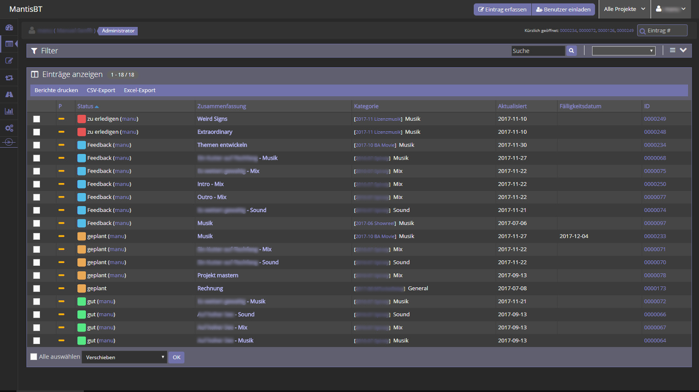

# Mantis Bugtracker Dark Theme

## About

I wanted a dark theme for MantisBT. While it's not enough to just add a `default.css` into the `config_inc.php` variable *$g_css_include_file*, I tried to write a plugin, which replaces the needed CSS classes. Maybe there are still some ugly colors or things - I'm no pro here. (-;

## Installation

Upload the whole folder into your `plugins/` folder in the mantis installation so that you e.g. have `MANTIS_INSTALLATION/plugins/MantisBTDarkTheme/MantisBTDarkTheme.php`. After that the plugin should show up on the `manage_plugin_page.php` page in the mantis settings. There you can simply install it to activate it.

## Your colors

I did not test it, but in theory you should even be able to *skin* it all with your own colors. The file `DarkTheme.sass` has some variables, which declare how the different shades look like. Mainly there are *tagi_*, *bg_* and *txt_* variables with different shades. *tagi_* is my corporate color, *bg_* variables are for the background colors and *txt_* variables are for text colors. Just test to chose your own color shadings and it won't only be a dark theme anymore! Oh, don't forget to compile the SASS into CSS after you changed the color-variables.

## Changelog

You can view the changelog [here: CHANGELOG.md](CHANGELOG.md).
